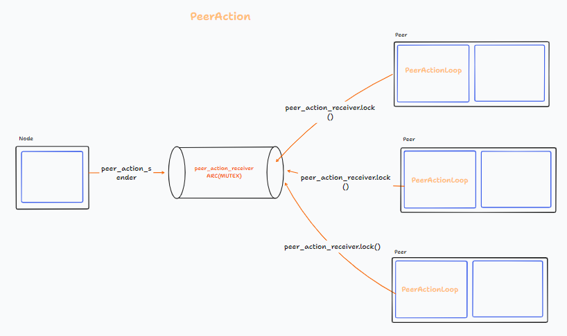
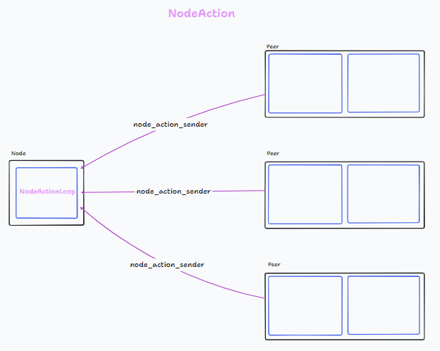
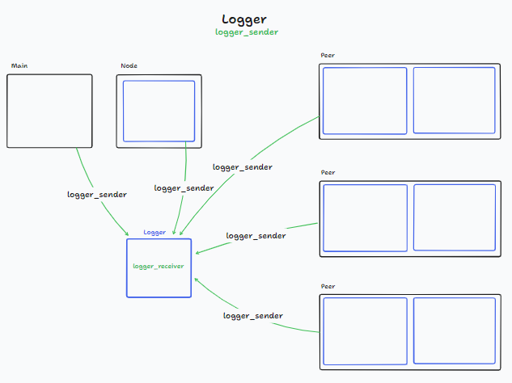

# 23C1-Rust-eze
Repo for Rust Taller De Programacion 1 FIUBA

## Compile and run

To compile and run the program, the config file must be created with the following format:
```
SEED=dns
PROTOCOL_VERSION=1
PORT=1
LOG=file
NPEERS=1
```
A working example of this is shown in the _example-config.txt_ file.

Then we run the following command line:
```
cargo run -- configpath
```

## Diagrams

In order to understand how the program works, some important diagrams are provided:






